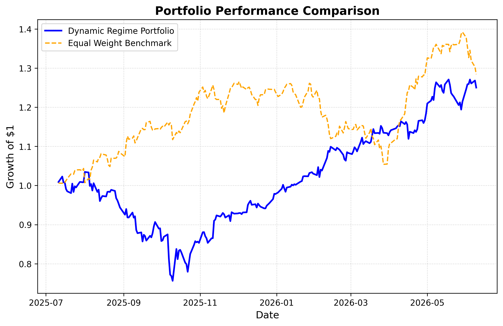

# Dynamic Regime Risk Engine

> Real-time market regime detection and portfolio risk monitoring platform powered by unsupervised machine learning and live market data.

[](https://dynamic-regime-risk-engine.onrender.com/)
[](https://www.python.org/)
[](https://streamlit.io/)
[](LICENSE)

---



---

## What it does

The engine classifies the current equity market into one of four regimes — **Bull, Sideways, Bear, or Crisis** — using a KMeans clustering model trained on SPY historical data. Based on the detected regime, it dynamically allocates a portfolio across SPY, QQQ, TLT, and GLD, and monitors live risk metrics including rolling VaR, drawdown, and volatility.

A scheduled daemon runs at 16:30 daily (post-market close) to infer the current regime, log portfolio returns, and update the equity curve. The Streamlit dashboard surface these metrics in real time with a traffic-light risk system.

---

## Architecture

```
live_engine.py          app.py (Streamlit)
──────────────          ──────────────────────
Download SPY data  →    Load frozen models
Build features         Fetch 120d market data
KMeans inference       Re-run feature pipeline
Log to CSV         →    Render dashboard + VaR
Schedule @ 16:30        Traffic light alert
```

**Models serialized to disk:**
- `frozen_regime_model.pkl` — trained KMeans (4 clusters)
- `regime_scaler.pkl` — StandardScaler fitted on training data
- `regime_label_map.pkl` — cluster index → regime name mapping

---

## Regime allocation matrix

| Regime   | SPY | QQQ | TLT | GLD | Trigger condition         |
|----------|-----|-----|-----|-----|---------------------------|
| Bull     | 40% | 50% | 10% |  0% | Low vol, upward trend     |
| Sideways | 25% | 15% | 30% | 30% | Moderate vol, no trend    |
| Bear     |  0% |  0% | 50% | 50% | Elevated vol, downtrend   |
| Crisis   | 10% |  0% | 40% | 50% | Extreme vol, deep drawdown|

---

## Backtest results (Jul 2025 – Jun 2026)

| Metric                  | Dynamic Portfolio | Equal-Weight Benchmark |
|-------------------------|:-----------------:|:----------------------:|
| Total return            | +25.4%            | +28.4%                 |
| CAGR                    | 28.0%             | —                      |
| Sharpe ratio            | 1.10              | —                      |
| Max drawdown            | -26.9%            | —                      |
| Annual volatility       | 25.3%             | —                      |
| Regime days (Bull)      | 103 / 231         | —                      |

> **Note:** These results contain look-ahead bias — the KMeans model is trained on the full historical window before backtesting. Walk-forward validation is on the roadmap. Treat metrics as directional, not production-grade.

---

## Quickstart

### 1. Clone and install

```bash
git clone https://github.com/Sarahpaws/Dynamic-Regime-Risk-Engine.git
cd Dynamic-Regime-Risk-Engine
pip install -r requirements.txt
```

### 2. Train the model

```bash
python live_engine.py --train
```

This downloads SPY data from 2020, fits the KMeans model, and serializes the three `.pkl` files to disk.

### 3. Run a live inference

```bash
python live_engine.py
```

Detects today's regime, logs results to `regime_results.csv`, and starts the 16:30 daily scheduler.

### 4. Launch the dashboard

```bash
streamlit run app.py
```

---

## Project structure

```
.
├── app.py                          # Streamlit dashboard
├── live_engine.py                  # Training, inference, scheduler
├── main.py                         # Full backtest pipeline
├── requirements.txt
├── models/
│   ├── frozen_regime_model.pkl
│   ├── regime_scaler.pkl
│   └── regime_label_map.pkl
├── data/
│   └── regime_results.csv          # Live inference log
└── assets/
    └── portfolio_performance_comparison.png
```

---

## Feature engineering

All features are derived from SPY daily closes:

| Feature  | Description                                          |
|----------|------------------------------------------------------|
| `vol_20` | 20-day rolling annualized volatility                 |
| `Trend`  | Binary: 1 if price > 20-day SMA, else 0              |
| `Drawdown` | (Price − rolling peak) / rolling peak              |

Features are standardized with `StandardScaler` before clustering.

---

## Dashboard

The live dashboard surfaces:

- **Traffic light risk system** — green / amber / red based on 60-day rolling 95% VaR
- **Current regime** with centroid confidence score and persistence duration
- **KPI strip** — VaR, trailing volatility, peak drawdown
- **Rolling VaR chart** — 60-day evolution of tail risk
- **Allocation matrix** — recommended weights for the active regime

---

## Known limitations

- **Look-ahead bias** — model is trained on the full historical window before backtesting. Walk-forward validation is not yet implemented.
- **No transaction costs** — daily rebalancing on regime switches assumes zero friction. Real performance would be lower.
- **3-feature model** — all signals come from SPY alone. No cross-asset macro signals (credit spreads, yield curve) are currently used.
- **Render free tier** — the live app may cold-start slowly after inactivity (~30s spin-up).

---

## Roadmap

- [ ] Walk-forward regime validation to remove look-ahead bias
- [ ] Transaction cost model (5–10bps per rebalance event)
- [ ] Cross-asset features: HYG/LQD credit spread, 2s10s yield curve slope
- [ ] Regime persistence filter (require N consecutive days before switching)
- [ ] Sortino and Calmar ratio in dashboard KPI row
- [ ] Modular refactor: `features.py`, `model.py`, `backtest.py`
- [ ] Unit test suite with pytest

---

## Requirements

```
streamlit
pandas
numpy
yfinance
scikit-learn
joblib
schedule
```

---

## License

MIT
